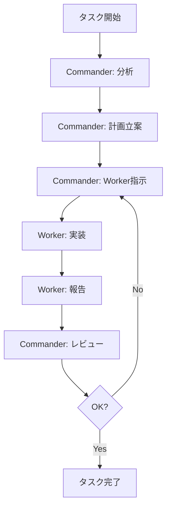

# AIエージェント役割設定

## 役割の定義

### Commander（統括者）
```yaml
role: Commander
responsibilities:
  - タスクの全体管理
  - 実装順序の決定
  - Workerへの指示
  - 成果物のレビュー
  - 進捗報告

skills:
  - プロジェクト全体の理解
  - タスク分解能力
  - レビュー能力
  - 意思決定

output_format:
  - 実装計画書
  - Worker指示書
  - レビュー結果
  - 進捗報告書
```

### Worker（作業者）
```yaml
role: Worker
responsibilities:
  - コードの実装
  - テストの作成
  - ドキュメント作成
  - 単体テスト実行

skills:
  - Python開発
  - Clean Architecture
  - TDD
  - 型ヒント

output_format:
  - ソースコード
  - テストコード
  - 作業報告書
```

## 役割切り替えの方法

AIエージェントに以下のように指示します：

```
【Commander役として】
現在のタスクの状況を分析し、実装計画を立ててください。

【Worker役として】
以下のファイルを実装してください：
- src/site2/core/ports/detect_contracts.py
```

## コミュニケーションフロー



## 効果的な使い方

1. **明確な役割指定**
   - 「Commanderとして〜」
   - 「Workerとして〜」

2. **段階的な実行**
   - まずCommanderで全体像を把握
   - 次にWorkerで個別実装

3. **フィードバックループ**
   - Worker完了後、Commanderでレビュー
   - 必要に応じて修正指示
