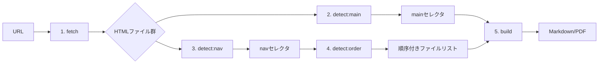

# site2 パイプライン設計書

## 概要

site2は、WebサイトをMarkdown/PDFに変換するパイプラインを提供します。
各コマンドは独立して動作可能で、かつパイプラインとして連携できるよう設計されています。

## パイプライン全体図



## 各ステップの詳細

### 1. fetch - Webサイトの取得

```yaml
入力:
  - url: string (https://example.com)

処理:
  - wgetを使用してサイトを再帰的に取得
  - キャッシュディレクトリに保存
  - 差分更新対応

出力:
  - cached_files: List[CachedFile]
    - url: string
    - local_path: Path
    - content_type: string
    - size: int
  - cache_directory: Path

標準出力:
  ✅ Fetched: https://example.com
  Pages: 15
  Total size: 1.2 MB
  Cache: ~/.cache/site2/example.com
```

### 2. detect:main - メインコンテンツの検出

```yaml
入力:
  - file_path: Path (キャッシュされたindex.html)

処理:
  - HTMLを解析
  - AIでメインコンテンツを検出. 実装例 examples/think_page_gemini/think_page_gemini.py
  - 複数の候補から最適なものを選択

出力:
  - file_path: Path
  - selectors: List[string]
    - "main.content"
    - "article.post"
    - "div#main-content"
  - confidence: float (0.0-1.0)

標準出力:
  main.content, article.post, div#main-content
```

### 3. detect:nav - ナビゲーションの検出

```yaml
入力:
  - file_path: Path (キャッシュされたindex.html)

処理:
  - HTMLを解析
  - ナビゲーション要素を検出
  - リンク構造を分析

出力:
  - file_path: Path
  - selectors: List[string]
    - "nav.primary"
    - "div.navigation"
    - "ul.menu"
  - confidence: float

標準出力:
  nav.primary, div.navigation, ul.menu
```

### 4. detect:order - ドキュメント順序の検出

```yaml
入力:
  - file_path: Path
  - nav_selector: string

処理:
  - ナビゲーションからリンクを抽出
  - 論理的な順序を推定
  - 階層構造を考慮

出力:
  - ordered_files: List[OrderedFile]
    - order: int
    - path: Path
    - title: string
    - level: int (階層レベル)

標準出力:
  1. index.html
  2. getting-started.html
  3. installation.html
  4. configuration.html
  5. advanced.html
```

### 5. build - ドキュメントの生成

```yaml
入力:
  - main_selector: string
  - ordered_files: List[OrderedFile]
  - format: "md" | "pdf"

処理:
  - 各ファイルからメインコンテンツを抽出
  - 指定された順序で結合
  - フォーマット変換

出力:
  - content: string | bytes (stdout)

標準出力:
  # Document Title

  ## Chapter 1
  ...
```

## autoコマンドの内部処理

`site2 auto`は上記の1-5を順次実行します：

```python
def auto(url: str, format: OutputFormat):
    # 1. fetch
    fetch_result = fetch_service.fetch(url)

    # 2. detect:main
    index_file = find_index_file(fetch_result.cached_files)
    main_selector = detect_service.detect_main(index_file)

    # 3. detect:nav
    nav_selector = detect_service.detect_nav(index_file)

    # 4. detect:order
    ordered_files = detect_service.detect_order(
        index_file,
        nav_selector
    )

    # 5. build
    content = build_service.build(
        main_selector,
        ordered_files,
        format
    )

    # 標準出力
    sys.stdout.write(content)
```

## データフロー型定義

```python
from dataclasses import dataclass
from pathlib import Path
from typing import List, Optional

@dataclass
class CachedFile:
    url: str
    local_path: Path
    content_type: str
    size: int

@dataclass
class FetchResult:
    cached_files: List[CachedFile]
    cache_directory: Path
    total_size: int
    pages_count: int

@dataclass
class SelectorResult:
    file_path: Path
    selectors: List[str]
    confidence: float
    primary_selector: str  # 最も信頼度の高いセレクタ

@dataclass
class OrderedFile:
    order: int
    path: Path
    title: str
    level: int  # 階層レベル（0=トップ, 1=サブ, ...）
    url: Optional[str]  # 元のURL

@dataclass
class OrderResult:
    ordered_files: List[OrderedFile]
    total_files: int
    navigation_found: bool
```

## エラー処理

各ステップで以下のエラーが発生する可能性があります：

1. **fetch**
   - NetworkError: 接続エラー
   - InvalidURLError: 無効なURL
   - CachePermissionError: 書き込み権限なし

2. **detect:main/nav**
   - FileNotFoundError: ファイルが存在しない
   - ParseError: HTML解析エラー
   - NoSelectorFoundError: セレクタが見つからない

3. **detect:order**
   - NoNavigationError: ナビゲーションが見つからない
   - InvalidStructureError: 構造が解析できない

4. **build**
   - ConversionError: 変換エラー
   - TemplateError: テンプレートエラー

## キャッシュ戦略

- fetchで取得したデータは`~/.cache/<domain>_<path>/`に保存
- メタデータは`cache.json`に記録
- 24時間以内は再取得しない（`--force`で強制更新）
