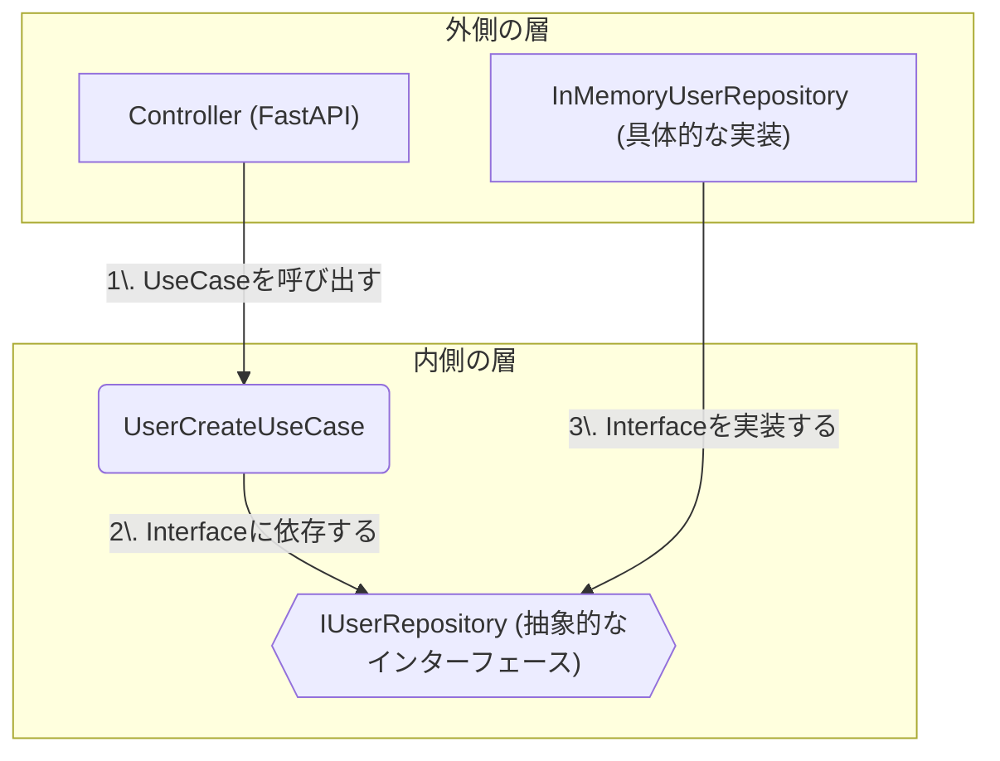

[TOC](/docs/TOC.md)

## クリーンアーキテクチャ (Clean Architecture) ガイド

このドキュメントは、私たちのチームが採用するソフトウェア設計思想である**クリーンアーキテクチャ**について、その目的、4層の構造、そしてPythonによる具体的な実装とテスト例をまとめたものです。

### 1\. クリーンアーキテクチャとは何か？

**クリーンアーキテクチャ**は、**関心の分離 (Separation of Concerns)** を徹底するためのソフトウェア設計思想です。その最大の目的は、システムの中心にある**ビジネスルール**を、フレームワーク、データベース、UIといった**外部の技術的詳細から完全に隔離する**ことです。

### 2\. 絶対的なルール：依存性のルール

このアーキテクチャで守るべきルールはただ一つです。

> **ソースコードの依存関係は、必ず外側から内側に向かわなければならない。**

つまり、内側の層は外側の層について**何も知りません**。このルールにより、システムの各部分が独立し、テストや変更が容易になります。

-----

### 3\. Pythonによる4層構造の実装例

ここでは、「ユーザー登録」というシンプルな機能を例に、各レイヤーをPythonでどう実装するかを見ていきましょう。

#### ① Entities: ビジネスの核となるルール

アプリケーション全体で共通の、最も中心的なビジネスルールを定義します。

`src/domain/entities.py`

```python
import re
from dataclasses import dataclass

@dataclass
class User:
    id: int
    name: str
    email: str

    def __post_init__(self):
        if len(self.name) < 3:
            raise ValueError("ユーザー名は3文字以上である必要があります")
        if not re.match(r"[^@]+@[^@]+\.[^@]+", self.email):
            raise ValueError("無効なメールアドレス形式です")
```

-----

#### ② Use Cases: アプリケーション固有のルール

特定のユースケースを実現するためのビジネスロジックを記述します。外層が実装すべき**インターフェース（抽象）を定義**するのが特徴です。

`src/application/use_cases.py`

```python
from abc import ABC, abstractmethod
from dataclasses import dataclass
from src.domain.entities import User

@dataclass
class UserCreateInput:
    name: str
    email: str

class IUserRepository(ABC):
    @abstractmethod
    def save(self, user: User) -> User:
        raise NotImplementedError

class UserCreateUseCase:
    def __init__(self, user_repository: IUserRepository):
        self.user_repo = user_repository

    def execute(self, input_data: UserCreateInput) -> User:
        user = User(id=None, name=input_data.name, email=input_data.email)
        created_user = self.user_repo.save(user)
        return created_user
```

-----

#### ③ Interface Adapters: 外部と内部の変換役

Use Cases層で定義されたインターフェースを**具体的に実装**したり、外部からの入力をUse Casesが理解できる形式に変換したりします。

##### 構造の図解 (Mermaid)

この層の役割は**依存性逆転の原則**を体現する、クリーンアーキテクチャの心臓部です。以下の図は、各コンポーネントの関係性を示しています。



**図のポイント**:

  * **矢印は依存の方向**を示します。
  * UseCase(内側)は、具体的なRepository(外側)を知りません。**抽象的なInterface(内側)にのみ依存**します。
  * これにより、`UseCases`層に影響を与えることなく、`Repository`の実装（DBの種類など）を自由に入れ替えることができます。

##### Python実装例

`src/infrastructure/repositories.py` (DB実装の例)

```python
import random
from src.application.use_cases import IUserRepository
from src.domain.entities import User

class InMemoryUserRepository(IUserRepository):
    _users = {}
    def save(self, user: User) -> User:
        user.id = random.randint(1, 1000)
        self._users[user.id] = user
        return user
```

`src/interfaces/controllers.py` (Webフレームワークとの接続役の例)

```python
from fastapi import FastAPI, HTTPException
from pydantic import BaseModel
from src.application.use_cases import UserCreateUseCase, UserCreateInput
from src.infrastructure.repositories import InMemoryUserRepository

app = FastAPI()
user_repository = InMemoryUserRepository()
user_create_usecase = UserCreateUseCase(user_repository)

class UserCreateModel(BaseModel):
    name: str
    email: str

@app.post("/users/", status_code=201)
def create_user_endpoint(user_data: UserCreateModel):
    try:
        input_data = UserCreateInput(name=user_data.name, email=user_data.email)
        created_user = user_create_usecase.execute(input_data)
        return {"id": created_user.id, "name": created_user.name, "email": created_user.email}
    except ValueError as e:
        raise HTTPException(status_code=400, detail=str(e))
```

-----

#### ④ Frameworks & Drivers: 最も外側の層

FastAPI、データベースドライバなど、具体的なツールや技術そのものです。

-----

### 5\. なぜこの構造にするのか？ (メリット)

  * **テスト容易性**: ビジネスロジック(Entities, Use Cases)は外部に依存しないため、単体で高速にテストできます。
  * **フレームワークからの独立**: WebフレームワークをFastAPIからDjangoに乗り換えても、内側の層は変更不要です。
  * **データベースからの独立**: データベースをPostgreSQLに変更しても、影響はRepositoryの実装部分に限定されます。
  * **保守性の向上**: 関心事が明確に分離されているため、コードが読みやすく、変更に強くなります。

-----

### 6\. 具体的なテスト例 (pytest)

クリーンアーキテクチャの最大の利点である「テスト容易性」を、`pytest`を使った具体的なコードで見てみましょう。FastAPIやデータベースを一切起動せずに、ビジネスロジックだけをテストできる点に注目してください。

#### ① Entities層のテスト

`tests/domain/test_entities.py`

```python
import pytest
from src.domain.entities import User

def test_user_creation_success():
    """正常なユーザーが作成できること"""
    user = User(id=1, name="testuser", email="test@example.com")
    assert user.name == "testuser"

def test_user_name_too_short():
    """ユーザー名が短すぎる場合にValueErrorが発生すること"""
    with pytest.raises(ValueError, match="ユーザー名は3文字以上"):
        User(id=1, name="ab", email="test@example.com")
```

#### ② Use Cases層のテスト

**テスト用の偽の（モック）リポジトリ**を準備することで、データベースに接続することなくユースケースをテストします。

`tests/application/test_use_cases.py`

```python
import pytest
from src.domain.entities import User
from src.application.use_cases import UserCreateUseCase, UserCreateInput, IUserRepository

# --- テスト用の偽リポジトリ (Test Double) ---
class MockUserRepository(IUserRepository):
    def __init__(self):
        self.saved_user = None

    def save(self, user: User) -> User:
        self.saved_user = user
        user.id = 123 # テスト用にダミーIDを設定
        return user

# --- テストケース ---
def test_user_create_use_case():
    """UserCreateUseCaseが正しくユーザーを作成し、リポジトリを呼び出すこと"""
    # 1. Arrange (準備)
    mock_repo = MockUserRepository()
    use_case = UserCreateUseCase(user_repository=mock_repo)
    input_data = UserCreateInput(name="John Doe", email="john@example.com")

    # 2. Act (実行)
    result = use_case.execute(input_data)

    # 3. Assert (検証)
    assert result.id == 123
    assert result.name == "John Doe"
    assert mock_repo.saved_user is not None
    assert mock_repo.saved_user.name == "John Doe"
```

-----

### まとめ

クリーンアーキテクチャは、一見するとファイル数が多く複雑に見えますが、長期的に保守・拡張していく大規模なアプリケーションにとっては、その複雑さを管理し、システムの寿命を延ばすための非常に強力な羅針盤となります。重要なのは\*\*「依存性のルール」\*\*を常に意識し、ビジネスロジックを技術的詳細から守り抜くことです。